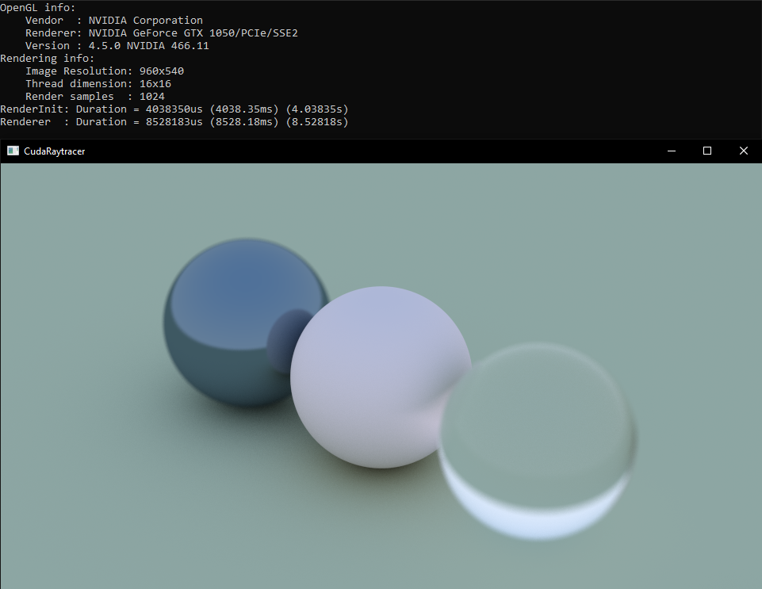
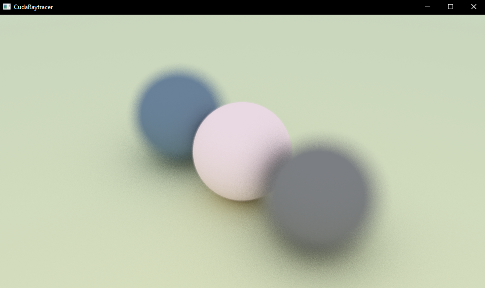
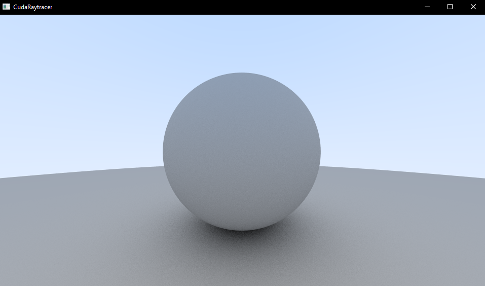
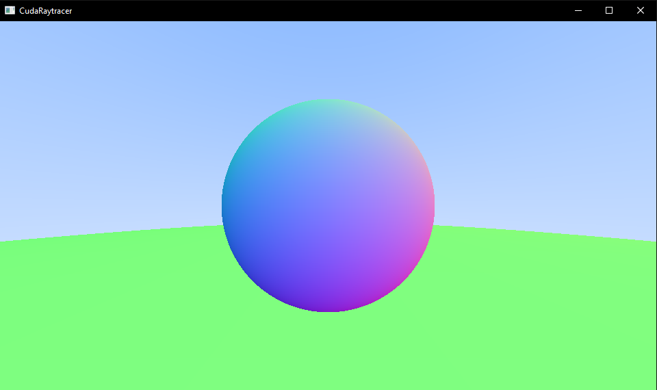
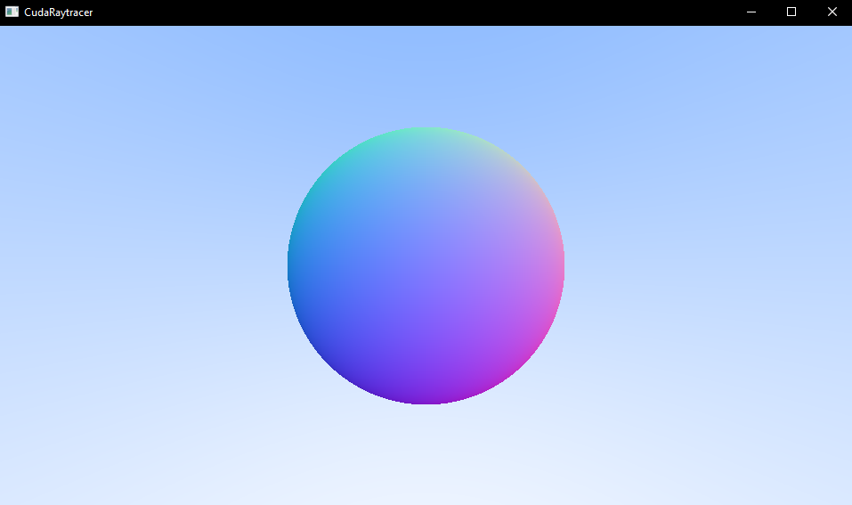
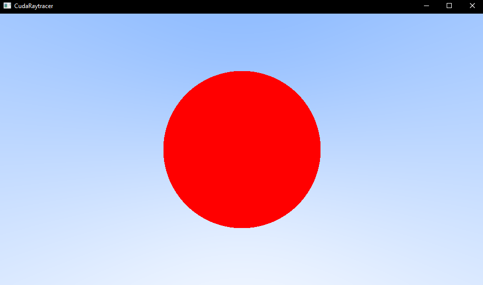

# CudaRaytracer
(WIP) This is a GPU accelerated Raytracer using CUDA. I have used OpenGL to display the results in a window. This project was built using CUDA 10.2 in Visual Studio 2019.

## References:
* [Accelerated Ray Tracing in One Weekend in CUDA](https://developer.nvidia.com/blog/accelerated-ray-tracing-cuda/)
* [Ray Tracing in One Weekend](https://raytracing.github.io/books/RayTracingInOneWeekend.html)

# Getting Started
For Windows
## Prerequisites
* [Visual studio](https://visualstudio.microsoft.com/vs/community/) 2019 or higher
* CUDA compatible GPU with compute capability >= 3.0
* [CUDA Toolkit v10.2](https://developer.nvidia.com/cuda-10.2-download-archive) or higher
* [CMake](https://cmake.org/download/)
* [GLFW binaries for your platform](https://www.glfw.org/)

## Set up using Premake
* Replace binaries in `ext/glfw/lib/` with the binaries for your platform
* Run ```WinGenerateProjectFiles.bat``` file
* In Visual Studio,
	* in Project properties>CUDA C/C++>Common
		* set ```Generate Relocatable Device Code``` to ```yes```
		* set ```Target Machine Platform``` to ```64-bit```
	* you might also have to exclude all .cu files and include them again and refresh the solution explorer (because vs2019 starts to compile with MSVC instead of NVCC initially)
* Then build and run the project

## Alternative set up using CMake (RECOMMENDED)
* Replace binaries in `ext/glfw/lib/` with the binaries for your platform
* Configure and build the project (this builds the project in Release mode)
```
cmake -S . -B build
cmake --build build --config Release
```

## Run
* You can optionally specify the number of samples and/or the height of the window as commandline arguments. (The implementation of commandline arguments is pretty basic, it will break if you don't provide an unsigned int of a reasonable size)
```
.\build\Release\CudaRaytracer.exe
// OR
.\build\Release\CudaRaytracer.exe 512
// OR
.\build\Release\CudaRaytracer.exe 512 1080
```

# Output:
This project was built and run on Intel i5-9300H cpu and Nvidia GTX 1050 gpu.\
Screenshots during development:

Positionable Camera with Defocus Blur (showing Metal, Diffuse, and Dielectric material) also showing console output (Render samples = 1024, apperture = 0.44, vFOV = 20)\


Positionable Camera with Defocus Blur (Only diffuse materials) (Render samples = 256, apperture = 2.0, vFOV = 30)\


Diffuse Material (Render samples = 256)\


Normal-colored Sphere with Ground\


Visualizing Normals\


First Sphere\


Gradient Sky\


# ToDo:
- [x] Ray Tracing in One Weekend
- [ ] Ray Tracing: The Next Week
- [ ] Ray Tracing: The Rest of Your Life
- [ ] keyboard and mouse support (make it interactive)
