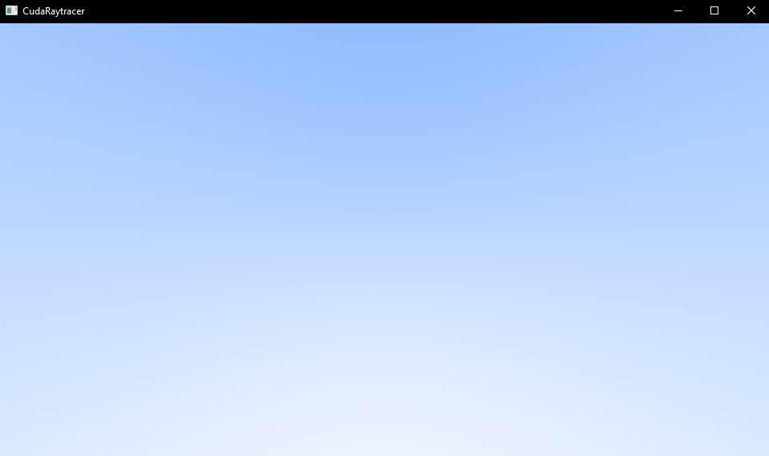

# CudaRaytracer
(WIP) This is a GPU accelerated Ray tracer using CUDA. I have used OpenGL to display the results in a window. It is built using CUDA 10.2 in Visual Studio 2019.

## References:
* [Accelerated Ray Tracing in One Weekend in CUDA](https://developer.nvidia.com/blog/accelerated-ray-tracing-cuda/)
* [Ray Tracing in One Weekend](https://raytracing.github.io/books/RayTracingInOneWeekend.html)

# Getting Started
For Windows 
* Run ```WinGenerateProjectFiles.bat``` file
* In Visual Studio, set Project>Build Dependencies>Build Configuration to CUDA
* Then build and run the project

# Output:
Screenshots during development:\
Gradient Sky\


# ToDo:
- [ ] Ray Tracing in One Weekend 
- [ ] Ray Tracing: The Next Week
- [ ] Ray Tracing: The Rest of Your Life
- [ ] keyboard and mouse support (also a kind of an editor)